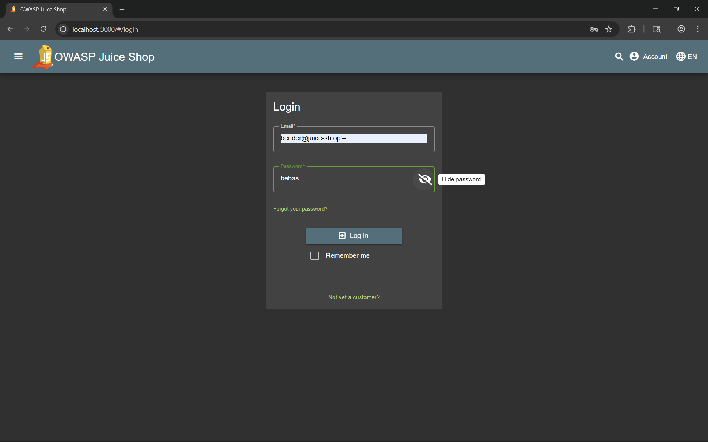

# Login Bender

Log in with Bender's user account.

# Tools used

- Browser
- swisskyrepo/PayloadsAllTheThings
- OSINT

# Solve

Using the same logic as [Login Jim](../login-jim/README.md), login using this email

```
bender@juice-sh.op'--
```

and random password




