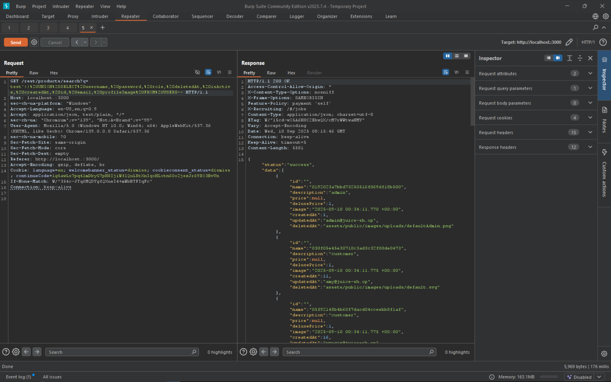

# User Credentials

Retrieve a list of all user credentials via SQL Injection.

# Tools used

- Browser
- swisskyrepo/PayloadsAllTheThings
- Burpsuite
- Cyberchef

# Solve

From burpsuite, we know that `/rest/products/search?q=` is the vulnerable endpoint and the `?q=param` is the vulnerable parameter. Even though this is for item, since it interracts directly with the database, we can assume that its possible to do it through this endpoint.
Send this payload as the parameter, but first encode it with url encoding

```
test')) UNION SELECT username, password, role, deletedAt, isActive, createdAt, id, email, profileImage FROM USERS--
```

