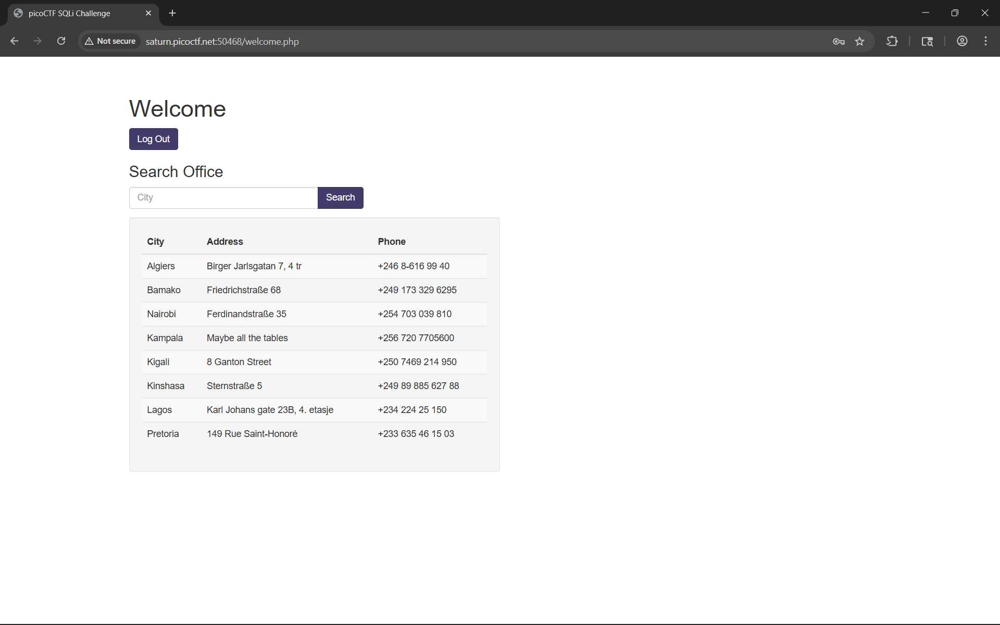

# More SQLi

Can you find the flag on this website.

> https://play.picoctf.org/practice/challenge/358

# Tools used

- Browser
- swisskyrepo/PayloadsAllTheThings
- Burpsuite

# Solve

We're given a login page. Lets try the usual sqli login trick

We see that the login is not successful and we actually see why. The password is parsed first before the username. So we can just flip the sqli and put the payload in the password

Here we see what seems to be a place to look for office. Seeing the available table i assumed this is going to be union based sqli. But when i inspect my burpsuite, i got the flag upon login? might be unintended

