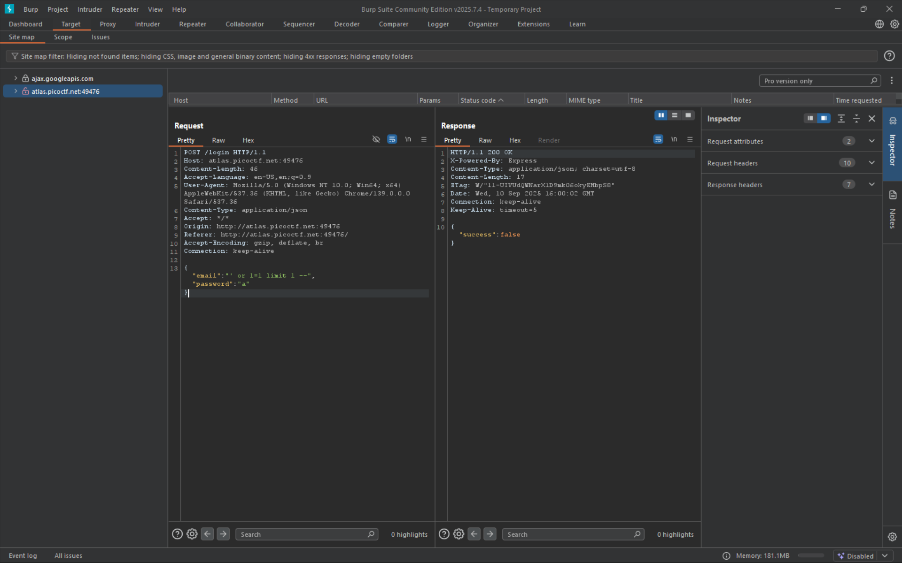

# No SQL Injection

Can you try to get access to this website to get the flag?

> https://play.picoctf.org/practice/challenge/443

# Tools used

- Browser
- swisskyrepo/PayloadsAllTheThings
- Burpsuite

# Solve

We're given a login page. Lets try the usual sqli login trick

It didnt work. But the name of the challenge does give us a hint that this is a nosql injection. So we use the {"$ne": null} trick to bypass the username and password check and get the flag

